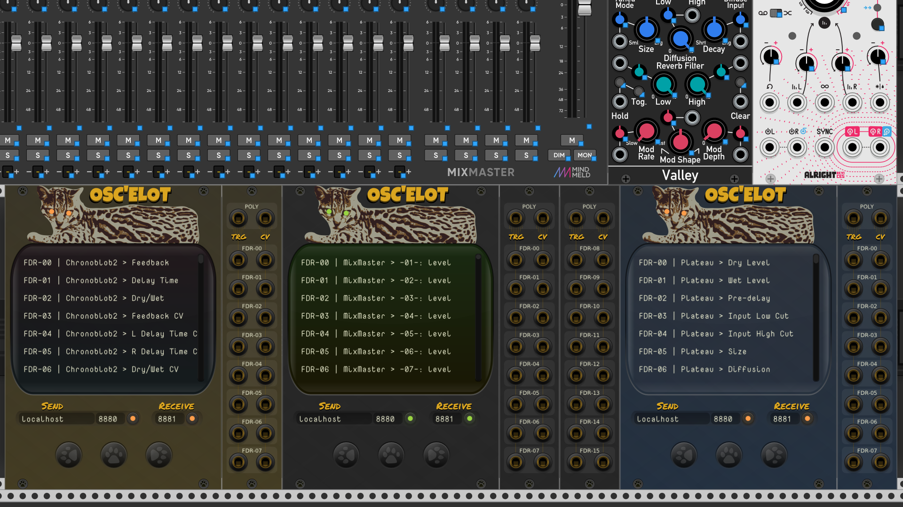

# OSC'elot

<!-- Version and License Badges -->

If you like my work consider donating to https://paypal.me/?. Thank you for your support!

## The modules of PackOne

[OSC'elot Manual](./docs/Oscelot.md): Map parameters to osc controllers with OSC feedback.

Feel free to contact me or create a GitHub issue if you have any problems or questions!  

## Special thanks

- [Stoermelder](https://library.vcvrack.com/?brand=stoermelder) for all his awesome modules, especially MIDI-CAT on which OSC'elot is based.
- [Omri Cohen](https://omricohencomposer.bandcamp.com/) for his fabulous video tutorials and fun live streams
- Andrew Belt for creating and developing VCV Rack

## License

All **source code** is copyright © 2021 and is licensed under the [GNU General Public License, version v3.0](./LICENSE.txt).

All **files** and **graphics** in the `res` and `res-src` directories are licensed under [CC BY-NC-ND 4.0](https://creativecommons.org/licenses/by-nc-nd/4.0/). You may not distribute modified adaptations of these graphics.