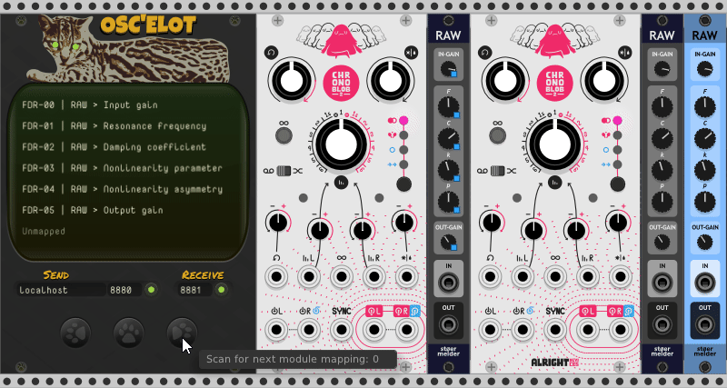

# OSC'elot

OSC'elot is a mapping module for OSC controllers based on stoermelder's MIDI-CAT.

 

* [Controller Types](#controller-types)
  + [Faders](#faders)
  + [Encoders](#encoders)
  + [Buttons](#buttons)
* [OSC Feedback](#osc-feedback)
* [Mapping parameters](#mapping-parameters)
  + [Map an entire module](#map-an-entire-module)
  + [Map parameters one at a time](#map-parameters-one-at-a-time)
* [MeowMory](#meowmory)
* [MeowMemory](#meowmemory)
* [Context-Label](#context-label)
* [Menu Options](#menu-options)
  + [Additional features](#additional-features)
* [Controller Modes](#controller-modes)
* [Expander](#expander)

 

---
## Controller Types
It currently supports mapping of Faders, Encoders and Buttons.

### Faders
- OSC Messages **must** have an address ending with `/fader`
- It **must** have two arguments, Id (Integer) and Value(Float between 0-1)
- > `/fader, args: (1, 0.5573)`

### Encoders
- OSC Messages **must** have an address ending with `/encoder`
- It **must** have two arguments, Id (Integer) and Delta Value(multiples of -1.0 or +1.0)
- Encoders have default sensitivity set to *649*
- > `/encoder, args: (1, -1.0)`

### Buttons
- OSC Messages **must** have an address ending with `/button`
- It **must** have two arguments, Id (Integer) and Value(0.0 or 1.0)
- > `/button, args: (1, 1.0)`

 

---
## OSC Feedback
If the Sender is activated, any parameter change will generate two OSC messages as feedback. On activation of the Sender it also sends these two messages for all currently mapped controls. This is useful for initialization of the controls on the OSC controller.  

For a fader mapped to a MixMaster Volume fader:  
> Sent from controller:  
`/fader/1/0.3499999940395355`

> Sent from OSC'elot:  
`/fader, args: (1, 0.3499999940395355)`  
`/fader/info, args: (1, 'MixMaster', '-01-: level', '-21.335', ' dB', 'MixMaster')`

For an encoder mapped to a MixMaster Pan knob:  
> Sent from controller:  
`/encoder/1/1.0`

> Sent from OSC'elot:  
`/encoder, args: (1, 0.5231125950813293)`  
`/encoder/info, args: (1, 'MixMaster', '-01-: pan', '4.6225', '%')`

The first message contains the id and the current value of the mapped param. (0.0-1.0)  
The second message ending with `/info` has the integer Id arg followed by info about the mapped param:  
| Name          | Type      | Value         | Notes                                     |
| ------------- |:---------:|:-------------:|-------------------------------------------|
| Id            | Integer   | `1`           | Id of mapped OSC controller               |
| ModuleName    | String    | `'MixMaster'` | Not affected by OSC'elot labels           |
| Label         | String    | `'-01-: pan'` | Not affected by OSC'elot labels           |
| DisplayValue  | String    | `'4.6225'`    | Value shown when for param in VCV         |
| Unit          | String    | `'%'`         | Blank string if param does not have units |
| ModuleSlug    | String    | `'MixMaster'` | Unique module name                        |

 

---
## Mapping parameters
A typical workflow for mapping your controller will look like this:

- Connect your OSC controller, whether physical/virtual by setting the receive port and starting the Receiver.
- If your controller can receive OSC messages you can set the send port and start the Sender.

 

### Map an entire module
This option changes your cursor into a crosshair which needs to be pointed onto any module within your patch by clicking on the panel.
  - *`Clear first`* clears OSC mappings before mapping new module. **SHORTCUT** `Ctrl/Cmd+Shift+D`
  - *`Keep OSC assignments`* keeps the OSC mappings and re-maps them onto the new module. **SHORTCUT** `Shift+D`

 

### Map parameters one at a time
- Activate the first mapping slot by clicking on it.
- Click on a parameter of any module in your patch. The slot will bind this parameter.
- Touch a control or key on your OSC device. The slot will bind the OSC message.
- Repeat this process until all the desired parameters have been mapped.

A blinking mapping indicator will indicate the bound parameter the mapping-slot which is currently selected. 

 

---
## MeowMory
OSC'elot allows you store an unlimited number of module-specific mappings which can be recalled for the same type of module without doing any mapping manually.  
A typical workflow will look like this:

- Create a mapping using your OSC device of any module in OSC'elot.
- Under the `MeowMory` section you have options to *`Store mapping`*. 
- The saved module mappings are listed under *`Available mappings`*.
- You can store only one mapping of any specific module-type. If you store a mapping for a module which has one already it will be replaced.
- You can remove any mapping using the the context menu *`Delete`*. Intializing the module does not remove them.

Stored module-mappings can be recalled by using the middle `Apply` button or hotkey `Shift+V` while hovering OSC'elot.  
The cursor changes to a crosshair and the saved OSC-mapping is loaded into OSC'elot after you click on a module in your patch.  

 

The `Prev` and `Next` buttons scan your patch from top-left to bottom-right and apply a stored mapping to the next/previous module of the current mapped module.  
Modules without a mapping will be skipped. This can also be triggered via OSC:  
> `/oscelot/next`  
> `/oscelot/prev`  

 

---
## MeowMemory
OSC'elot can save and broadcast an arbitrary string value sent from a connected OSC client (which will be saved in OSC'elot module presets etc).  

This allows a connected OSC client application to use OSC'elot as a brain to remember and retrieve information related to the current VCVrack patch (e.g. layout of controls for specific mapped modules).

### Save client state in OSC'elot

Send from client to OSC'elot:
`/oscelot/storestate, args: ('Some stringified state') `

| Name          | Type      | Value         | Notes                                     |
| ------------- |:---------:|:-------------:|-------------------------------------------|
| State         | String   | `'<some arbitrary string>'`   | Client state string        |      

### Retrieve client state from OSC'elot

Send a request message to OSC'elot:
`/oscelot/getstate`  (no args)

OSC'elot wil respond with a `/state` message:
`/state, args: ('<stored client state string>')`

| Name          | Type      | Value         | Notes                                     |
| ------------- |:---------:|:-------------:|-------------------------------------------|
| State         | String   | `'<some arbitrary string>'`   | Client state string        |  

 

---
## Context-Label
After a parameter has been mapped the parameter's context menu is extended with some addtional menu items allowing quick OSC learning and centering it's OSC'elot module on the center of the screen.

 There are even further options when you set a `Context label`. This allows you to name each instance of OSC'elot in your patch. This name can be addressed in any parameter's context menu for activating OSC mapping or re-mapping parameters to an existing OSC control.

 

---
## Menu Options
*`Re-send OSC feedback`* allows you to manually send feedback for all mapped parameters back to your OSC device.
- The *`Now`* option can be useful if you switch/restart your OSC device or the device needs to be initalized again.
- The *`Periodically`* option when enabled sends OSC feedback **once a second** for all mapped controls regardless of whether the parameter has changed.

*`Locate and indicate`*:  
Received OSC messages have no effect on the mapped parameters, instead the module is centered on the screen and the parameter mapping indicator flashes for a short period of time. When finished verifying all OSC controls switch back to *`Operating`* mode for normal operation of OSC'elot.

*`Lock mapping slots`*:  
Accidental changes of the mapping slots can be prevented by using this option, which locks access to the mapping slots.
- Scrolling Rack's current view by mouse is interrupted by OSC'elot's list widget while hovered. As this behavior can be annoying all scrolling events are ignored if _Lock mapping slots_ is enabled.

*`Ignore OSC devices`*:  
Skips any OSC device settings when loading a preset into OSC'elot, only mapping slots will be loaded.

### Additional features

- The text shown in every mapping slot can be replaced by a custom text label in the context menu. It's prefilled by default with the automatic label.
- If you find the blue mapping indicators distracting you can disable them in OSC'elot's context menu.
- An active mapping process can be aborted by hitting the `ESC`-key while hovering the mouse over OSC'elot.
- An active mapping slot can be skipped by hitting the `SPACE`-key while hovering the mouse over OSC'elot.
- Settings of a mapping slot are copied from the previous slot: If you set up the first mapping slot and map further mapping slots afterwards, these settings are copied over. Useful for settings like Encoder Sensitivity and Controller mode.

 

---
## Controller Modes

This pretty much works the same as `MIDI-CAT`. By default the mode is set to `DIRECT`.  
Encoders are always `DIRECT`. Buttons and faders can be changed to other modes below.  
You will likely only need to change this if using a hardware OSC controller.

- **`Direct`**: Every received OSC message is directly applied to the mapped parameter (*default*).

- **`Pickup (snap)`**: OSC messages are ignored until the control reaches the current value of the parameter. After that the OSC control is "snaped" unto the parameter and will only unsnap if the parameter is changed from within Rack, e.g. manually by mouse or preset-loading.

- **`Pickup (jump)`**: Same as snap-mode, but the control will loose the parameter when jumping to another value. This mode can be used if your OSC controller supports switching templates and you don't want your parameters to change when loading a different template.

- **`Toggle`**: Every OSC message toggles the parameter between its minimum and maximum value (usually for buttons)

- **`Toggle + Value`**: Every OSC message toggles the parameter between its minimum and the control's value.

 

---
## Expander

The expander adds a Poly `trigger` and `CV` output along with 8 individual `trigger` and `CV` outputs for any configured controllers. The default CV range is `-5V to 5V`, but this can be changed in the right-click menu. 

