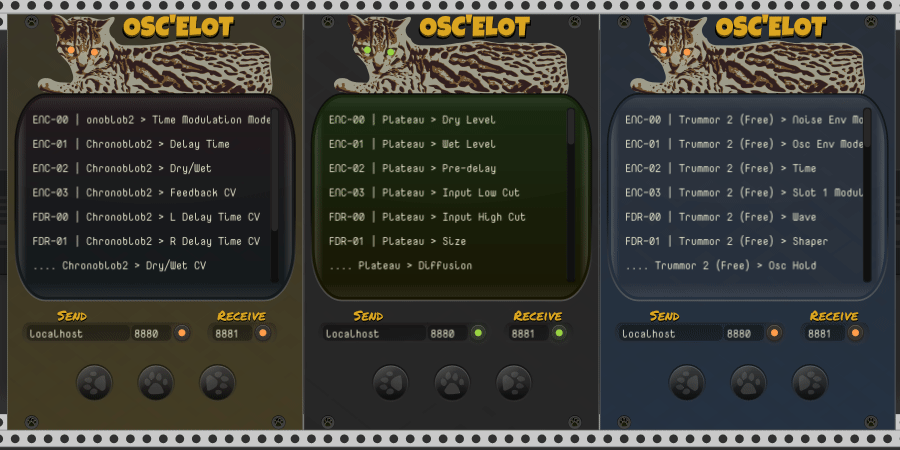

# OSC'elot

OSC'elot is a mapping module for OSC controllers based on stoermelder's MIDI-CAT.

 

---
## Controller Types
It currently supports mapping of Faders, Encoders and Buttons.

### Faders
- OSC Messages **must** have an address ending with `/fader`
- It **must** have two arguments, Id (Integer) and Value(Float between 0-1)
- `/fader, args: (1, 0.5573)`

### Encoders
- OSC Messages **must** have an address ending with `/encoder`
- It **must** have two arguments, Id (Integer) and Delta Value(multiples of -1.0 or +1.0)
- Encoders have default sensitivity set to *649*
- `/encoder, args: (1, -1.0)`

### Buttons
- OSC Messages **must** have an address ending with `/button`
- It **must** have two arguments, Id (Integer) and Value(0.0 or 1.0)
- `/button, args: (1, 1.0)`

 

---
## OSC Feedback

If the Sender is activated, any parameter change will generate two OSC messages as feedback. On activation of the Sender it also sends these two messages for all currently mapped controls. This is useful for initialization of the controls on the OSC controller.  

For a fader mapped to a MixMaster Volume fader:  
> Sent from controller:  
`/fader/1/0.3499999940395355`

> Sent from OSC'elot:  
`/fader, args: (1, 0.3499999940395355)`  
`/fader/label, args: (1, 'MixMaster', '-01-: level', '-21.335', ' dB')`

For an encoder mapped to a MixMaster Pan knob:  
> Sent from controller:  
`/encoder/1/1.0`

> Sent from OSC'elot:  
`/encoder, args: (1, 0.5231125950813293)`  
`/encoder/label, args: (1, 'MixMaster', '-01-: pan', '4.6225', '%')`

The first message contains the id and the current value of the mapped param. (0.0-1.0)  
The second message ending with `/label` has the integer Id arg followed by info about the mapped param:  
| Name          | Type      | Value         | Notes                                     |
| ------------- |:---------:|:-------------:|-------------------------------------------|
| Id            | Integer   | `1`           | Id of mapped OSC controller               |
| ModuleName    | String    | `'MixMaster'` | Not affected by OSC'elot labels           |
| Label         | String    | `'-01-: pan'` | Not affected by OSC'elot labels           |
| DisplayValue  | String    | `'4.6225'`    | Value shown when for param in VCV         |
| Unit          | String    | `'%'`         | Blank string if param does not have units |

 

---
## Mapping parameters

A typical workflow for mapping your OSC-controller will look like this:

- Connect your OSC controller, whether physical/virtual by setting the receive port and starting the Receiver.
- If your controller can receive OSC messages you can select the output port and start the Sender.
- Activate the first mapping slot by clicking on it.
- Click on a parameter of any module in your patch. The slot will bind this parameter.
- Touch a control or key on your OSC device. The slot will bind the OSC message. (See details below)
- Repeat this process until all the desired parameters have been mapped.

A blinking mapping indicator will indicate the bound parameter the mapping-slot which is currently selected. 

 

---
## Map an entire module  
  This option changes your cursor into a crosshair which needs to be pointed onto any module within your patch by clicking on the panel.
  - *`Clear first`* clears OSC mappings before mapping new module. **SHORTCUT** `Ctrl/Cmd+Shift+D`
  - *`Keep OSC assignments`* keeps the OSC mappings and re-maps them onto the new module. **SHORTCUT** `Shift+D`

 

---
## "Soft-takeover" or "Pickup" for CCs

OSC'elot supports a technique sometimes called "soft-takeover" or "pickup": If the control on your OSC device has a position different to the mapped parameter's position all incoming OSC messages are ignored until the parameter's position has been "picked up". This method must be enabled for each mapping-slot in the context menu: 

- **Direct**: Every received OSC CC message is directly applied to the mapped parameter (default).

- **Pickup (snap)**: OSC CC messages are ignored until the control reaches the current value of the parameter. After that the OSC control is "snaped" unto the parameter and will only unsnap if the parameter is changed from within Rack, e.g. manually by mouse or preset-loading.

- **Pickup (jump)**: Same as snap-mode, but the control will loose the parameter when jumping to another value. This mode can be used if your OSC controller supports switching templates and you don't want your parameters to change when loading a different template.

- **Toggle**: Every OSC _continuous control_ message toggles the parameter between its minimum and maximum value (usually 0 and 1 for switches) (added in v1.9.0).

- **Toggle + Value**: Every OSC _continuous control_ message toggles the parameter between its minimum and the control's value (added in v1.9.0).

 

---
## Note-mapping

OSC'elot supports mapping of OSC note-messages instead of OSC CC. There are different modes availbale as note-messages work differently to continuous controls:

- **Momentary**: Default setting, when a OSC note is received the parameter will be set to its maximum value (an OSC velocity of 127 is assumed).

- **Momentary + Velocity**: same as "Momentary", but the OSC velocity of the note is mapped to the range of the parameter.

- **Toggle**: Every OSC _note on_ message toggles the parameter between its minimum and maximum value (usually 0 and 1 for switches).

- **Toggle + Velocity**: Every OSC "note on" message toggles the parameter between its minimum and the note's velocity value (added in v1.8.0).

Some controllers with push-buttons don't handle "note off" messages the way the message is intended, hence a mapping-slot can be switched with the option _Send "note on, vel 0" on note off_ to send a "note on" message with "velocity 0" as OSC feedback instead (since v1.7.0).

 

---
## Additional features
The option _Re-send OSC feedback_ on OSC'elot's context menu allows you to manually send the values of all mapped parameters back to your OSC device (since v1.7.0). This option can be useful if you switch your OSC device while running Rack or the device behaves strangely and needs to be initalized again.

For some OSC controllers which don't support different simultaneous "layers" but different presets which can be switched (e.g. Behringer X-Touch Mini) there is an additional submenu option _Periodically_ (since v1.8.0): When enabled OSC'elot sends OSC feedback twice a second for all mapped controls regardless of parameter has been changed.

 
- The module allows you to import presets from VCV OSC-MAP for a quick migration.

- The module can be switched to "Locate and indicate"-mode: Received OSC messages have no effect to the mapped parameters, instead the module is centered on the screen and the parameter mapping indicator flashes for a short period of time. When finished verifying all OSC controls switch back to "Operating"-mode for normal module operation of OSC'elot.

- The text shown in every mapping slot can be replaced by a custom text label in the context menu (since v1.4.0).

- If you find the yellow mapping indicators distracting you can disable them on OSC'elot's context menu (since v1.5.0).

- Accidental changes of the mapping slots can be prevented by the option _Lock mapping slots_ in the context menu which locks access to the widget of the mapping slots (since v1.5.0).

- Scrolling Rack's current view by mouse is interrupted by OSC'elot's list widget while hovered. As this behavior can be annoying all scrolling events are ignored if _Lock mapping slots_ is enabled (since v1.7.0).

- An active mapping process can be aborted by hitting the ESC-key while hovering the mouse over OSC'elot (since v1.7.0).

- An active mapping slot can be skipped by hitting the SPACE-key while hovering the mouse over OSC'elot (since v1.8.0).

- Settings of a mapping slot are copied from the previous slot: If you set up the first mapping slot and map further mapping slots afterwards, these settings are copied over. Useful for settings like "Pickup" or "14-bit CC".

- After a parameter has been mapped the parameter's context menu is extended with some addtional menu items allowing quick OSC learning and centering it's mapping OSC'elot module on the center of the screen (since v1.8.0). There are even further options with the [CTX-expander](Oscelot.md#ctx-expander).

 

---
## MEM-expander

MEM is a companion module for OSC'elot: The expander allows you store an unlimited number of module-specific mappings which can be recalled for the same type of module without doing any mapping manually.  
A typical workflow will look like this:

- Place MEM on the right side of OSC'elot.
- Create a mapping using your OSC device of any module in OSC'elot.
- You find a new option _Store mapping_ in the _MEM-expander_-section of OSC'elot's context menu. The submenu shows all module-types which are currently mapped in OSC'elot. If you mapped only one module in OSC'elot there will be only one item.
- The module-mapping is listed under _Available mappings_ in the context menu after storing. The number on the display of MEM will also increase by 1.
- If you like you can repeat this process: Clear the mapping-slots of OSC'elot and repeat for another module-type.

Stored module-mappings can be recalled by context menu option _Apply mapping_ or hotkey Shift+V while hovering OSC'elot or using the button on the panel of MEM. The cursor changes to a crosshair and the OSC-mapping is loaded into OSC'elot after you click on a panel of module in your patch and MEM contains a mapping for this module-type.

MEM should be considered as a sort of "memory-unit" for OSC'elot: The module-specific mappings are saved inside the MEM-module and can be exported using Rack's preset functionality on the context menu. This means you can reuse the same mappings in different instances of OSC'elot or multiple patches, independently of any current mapping of OSC'elot.

MEM is not designed to map and recall mappings for different types of modules the same time. If you desire to recall a specific mapping-setup into OSC'elot you can use stoermelder [8FACE](./EightFace.md) which applies a complete setup by loading a preset of OSC'elot. For this purpose an option _Ignore OSC devices on presets_ has been added (since v1.8.0) which skips any OSC device settings when loading a preset into OSC'elot, only settings for all mapping slots will be recalled.

Added in v1.8.0: MEM has two buttons labeled _Prev_ and _Next_ which scan your patch from top-left to bottom-right and apply a stored mapping to the next/previous module of the current mapped module. Modules without a mapping available in MEM will be skipped while scanning obviously. This function is especially useful when triggering _Next_ and _Prev_ with a OSC controller which allows you to control your patch without touching the mouse or keyboard and without static mapping, for example.

### Tips for MEM

- MEM can store only one mapping of any specific module-type. If you store a mapping for a module which has a mapping already it will be replaced.

- You can remove any mapping using the the context menu _Delete_.

- All push buttons on MEM can be mapped using any mapping module if you like to activate _Apply mapping_ by OSC or some other command.

MEM for OSC'elot was added in v1.7 of PackOne.

 

---
## CTX-expander

CTX is a second companion module for OSC'elot: The expander allows you to name each instance of OSC'elot in your patch. This name can be addressed in every parameters' context menu for activating OSC mapping or re-mapping parameters to an existing OSC control or note mapping in another mapping slot of OSC'elot.

CTX for OSC'elot must be placed on the right side of OSC'elot and can be used the same time as the MEM-expander. The display can hold up to 8 characters for naming OSC'elot.

Additionally OSC'elot CTX provides a button for activating mapping on the first empty mapping slot in OSC'elot. This button can also mapped to a OSC controller which allows start OSC mapping by a OSC message.

CTX for OSC'elot was added in v1.9 of PackOne.